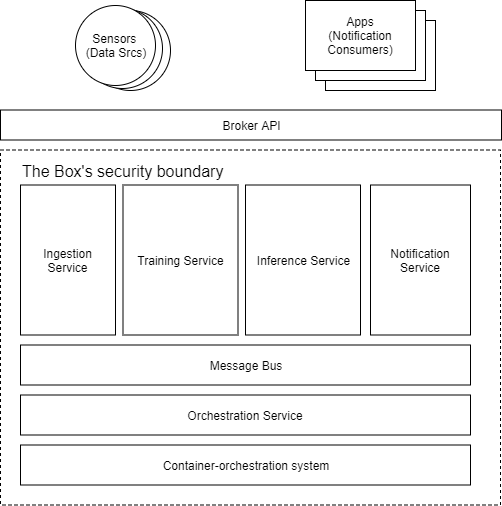

# Design of 'The Box'

The Box is designed to be work like a distributed scalable on-premise Machine Learning pipeline. Upper stream sensors sends data into The Box and prediction (in the form of notifications that are sometimes termed 'intent') are pushed to downstream applications (or polled by downstream applications).

## Architecture Overview

The current prototype of The Box interacts with outside world via:
- Messaging endpoint for ingesting data and receiving notifications
- REST API for controlling the behavoir of The Box, such as deploying new intelligent scenarios

Sensors or proxy to the sensors are responsible for pumping data to the message endpoint which will then be used for both inference and training for deployed scenarios inside The Box.

The output of The Box, termed 'intent', is derived from the prediction results from the machine learning models for the deployed scenarios. The early prototype directly pump out the notifications triggered by hand-crafted rule evaluation against each prediction result via the messaging endpoint. Sometimes this can be too chatty. In future implementation, we plan to add polling in addition to pushing, as well as change notification (e.g. via state operator of Kakfa streaming).

Inside the box consists of a few services to form a ML pipeline:
- Ingestion Service: transform raw signals into features used by training and inference. In early prototype this services does not exist and assumption was made that raw signals can be directly used as feature
- Inference Service: runs ML model and output predictions.
- Training Service: trains ML model
- Orchestration Service: powers the APIs to configure The Box
- Notification Service: service that turns prediction result from inference to notifications to be sent downstream to external applications
- Message Bus: facilitate communications between services. In early prototype, this also doubles as input/output messaging endpoint and signal storage, and will likely to change.
- Container Orchestration: infrastucture services that is responsible to spin up the services (containers) and scales the service instances on-demand.

## Technology choices

We use Apache Kafka for messaging due to avaibility of various programming language bindings and relatively wide deployment in the real world. The other reason is that Apache Kafka can double as log-storage for messages without the need to implement a feature store initially.

Docker is an obvious choice for containerization and we use Kubernetes for container orchestration  to manage the micro-service containers.

## Roadmap for development

* Training service, model verification and update
  Enables fine-tunning of cloud-trained generic models on the edge, as well evaluation of model performances as criteria for model deployment
* Signal source Identity and Registration
  We need a way to manage signal sources and tie the notification to specific source
* Feature storage
  Currently Kafka doubles as storage but we need better feature storage for long term data)
* Windows Containers
  We may need to run the workload on Windows Kernel instead of Linux Kernel depending on the underlying H/W platform to run The Box
